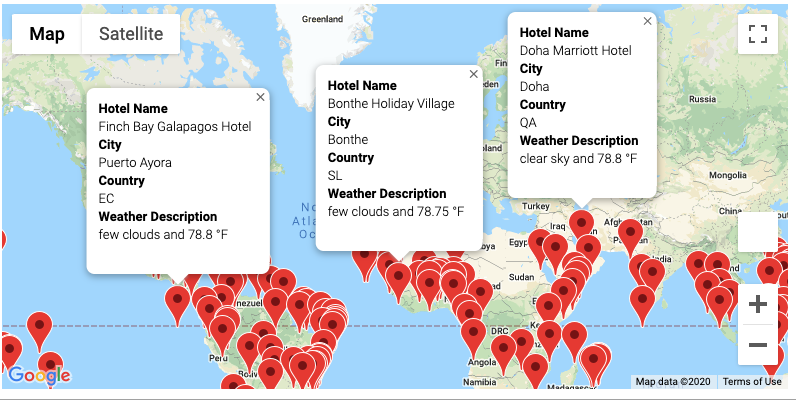
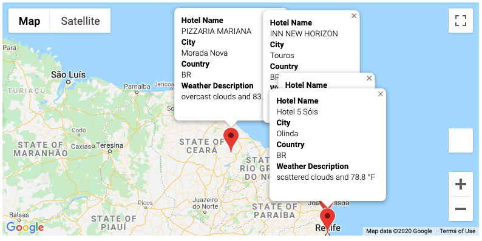
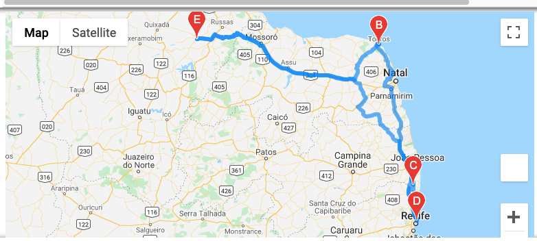

# WeatherPy
## APIs - Google, CitiPy, OpenWeatherMap

## Overview
The challenge has 3 parts:
- Weather Database
- Vacation Search
- Vacation Itinerary

### Weather Database
The purpose of the first part of the challenge was to use APIs to find specific, current weather conditions unique to random locations (found via latitude and longitude) throughout the planet. 

</img>

### Vacation Search
This part of the assignment is to use the csv file created by our weather database to search for places on the planet that have the desired temperature range of the user. I used (75-95 F). Based on that information we were able to use google nearby search to the most popular hotel in the cities found in part 1.

</img>

### Vacation Itinerary
The third part of the challenge looks at where to find directions and a marker map of four nearby cities found through our previous vacation search. My itinerary is a trip planned along the east coast of Brazil.
</img>

## APIs used:
Open Weather Network API
Google Maps APIs
    
- Google Places APIs
- Google Directions APIs

